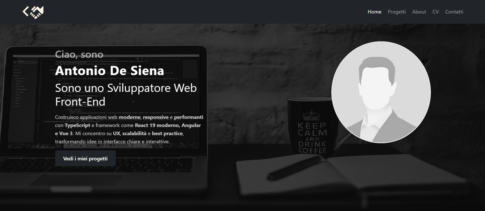

<!-- PROJECT SHIELDS -->

<!-- PROJECT LOGO -->
 

  

  <h3 align="center">Portfolio — Antonio De Siena</h3>

  

    Sito portfolio multi-pagina realizzato da zero in HTML, CSS e JavaScript, con layout responsive, caroselli dinamici e animazioni.
     
    <a href="https://antoniods1.github.io/html-Portfolio/index.html"><strong>Visita la demo »</strong></a>
      
    <a href="https://github.com/AntonioDS1/html-Portfolio/issues">Segnala Bug</a>
    ·
    <a href="https://github.com/AntonioDS1/html-Portfolio/issues">Richiedi Funzionalità</a>
  

---

## 📌 About the Project

Questo progetto è il mio portfolio personale, costruito come un vero sito professionale e strutturato in più pagine.  
L’obiettivo è presentare:

- competenze reali da front-end developer  
- progetti completati  
- stile visivo coerente  
- codice pulito e mantenibile  
- UX chiara, con focus su navigazione e leggibilità  

Caratteristiche principali:

✔️ 5 pagine complete: **Home, Progetti, About, CV, Contatti**  
✔️ **Layout responsive** (desktop → tablet → mobile)  
✔️ **Navbar dinamica + menu hamburger mobile**  
✔️ **Carosello progetti** con animazione shuffle personalizzata  
✔️ **Hero section animata** con transizioni CSS  
✔️ **Sidebar laterale** nella pagina “Progetti”  
✔️ **Meta-tag OG completi** in ogni pagina  
✔️ **Form di contatto funzionante** tramite Formspree  
✔️ Codice ottimizzato e strutturato  

(<a href="#readme-top">back to top</a>)

---

## 🧩 Code Structure

Struttura del progetto:

html-Portfolio/
│
├── index.html
├── assets/
│ ├── style.css
│ ├── Immagini/
│ ├── pagine/
│ │ ├── about.html
│ │ ├── progetti.html
│ │ ├── cv.html
│ │ └── contattami.html
│ └── script/ (eventuali JS)
│
└── README.md

yaml
Copia codice

Tecniche principali:

- CSS Grid, Flexbox, media queries
- Animazioni CSS (fade, slide, transform)
- JavaScript DOM (toggle menu, carosello, animazioni)
- HTML semantico
- Immagini ottimizzate
- Organizzazione pulita del codice

(<a href="#readme-top">back to top</a>)

---

## 🛠️ Built With

- HTML5
- CSS3 (responsive design, animazioni)
- JavaScript
- Bootstrap 5.3.8
- GitHub Pages

(<a href="#readme-top">back to top</a>)

---

## 🚀 Getting Started

Clona il repository:

git clone https://github.com/AntonioDS1/html-Portfolio.git

yaml
Copia codice

Apri la homepage:

index.html

yaml
Copia codice

Nessuna dipendenza da installare.

### Online Demo

👉 https://antoniods1.github.io/html-Portfolio/index.html

(<a href="#readme-top">back to top</a>)

---

## 📄 Pages Overview

### 🏠 Home  
Hero, foto profilo, presentazione rapida, progetti in evidenza.

### 📚 Progetti  
Carosello dinamico animato, sidebar, preview cliccabili, pulsanti GitHub.

### 👤 About  
Storia personale, percorso, competenze, foto e branding.

### 📄 CV  
Layout professionale in due colonne, competenze, esperienze, certificazioni.

### ✉️ Contatti  
Form funzionante, verifica anti-spam, informazioni personali.

(<a href="#readme-top">back to top</a>)

---

## 📬 Contact

**Antonio De Siena**  
GitHub: https://github.com/AntonioDS1  
Portfolio: https://antoniods1.github.io/html-Portfolio/index.html  
LinkedIn: https://www.linkedin.com/in/antonio-de-siena-2a5b752b6  

(<a href="#readme-top">back to top</a>)

---

## ⭐ Contributing

Puoi segnalare bug, suggerimenti e nuove feature tramite una *Issue*.

---

## 📝 License

Distribuito sotto licenza **MIT**.

---

  Grazie per aver visitato il mio portfolio!

